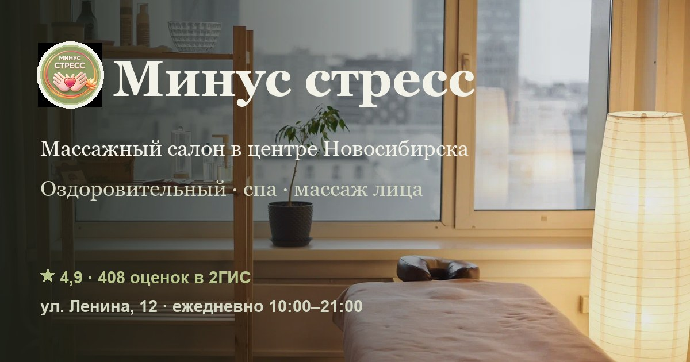

# Минус стресс — сайт массажного салона

Одностраничный сайт-**концепт** для массажного салона «Минус стресс» (No Stress) в центре
Новосибирска: витрина услуг с ценами, мастера, отзывы, видео-hero и запись — собраны в одном
фирменном месте.

**Демо:** https://nikita41478.github.io/NoStress/



## О проекте

Это спек-концепт (черновик на реальных данных салона), а не официальный сайт компании. Салон
с сильной репутацией (2ГИС — 4,9 по 408 оценкам) жил на типовой визитке, а онлайн-запись — на
отдельной странице. Идея концепта — собрать репутацию, витрину, мастеров и запись в одном
фирменном доме.

Дизайн-направление — «Органик / ботаника»: тёплый овсяный фон, шалфейный акцент, шрифты
Spectral + Golos Text.

## Возможности

- **Видео-hero** — карусель вертикальных клипов 9:16 (автоплей активного слайда, свайп, стрелки, точки)
- **Услуги по категориям** с ценами (массаж тела и лица, антицеллюлитный, аппаратные методики, спа, дополнения)
- **Мастера** — клик по карточке подставляет мастера в форму записи
- **Отзывы** из 2ГИС + кнопки-ссылки на профили 2ГИС и Яндекс
- **Галерея** работ и интерьера с лайтбоксом, **FAQ**, блок «о студии»
- **Форма записи** с маской телефона, RU-валидацией и согласием на обработку ПДн (152-ФЗ)
- Адаптив mobile-first, липкая кнопка записи, плавающие кнопки VK / Telegram
- **SEO:** JSON-LD `LocalBusiness`, статические Open Graph / Twitter-теги, фавикон
- Политика обработки персональных данных — [`policy.html`](policy.html)

## Технологии

Чистый **HTML + CSS + JavaScript**, без фреймворков и внешних библиотек. Анимации — только
CSS transitions / WAAPI. Медиа оптимизированы: изображения в **WebP**, видео в **H.264 MP4**
(720×1280, без звука, ≤ 2 МБ каждое).

## Структура

```
index.html        — главная страница
policy.html       — политика обработки персональных данных
images/           — изображения (WebP) + og.jpg + favicon.png
videos/           — hero-клипы (MP4) и их постеры (WebP)
```

## Локальный запуск

```bash
python -m http.server 8099
# затем открыть http://127.0.0.1:8099/
```

## Статус

Концепт-черновик. Форма записи работает в демонстрационном режиме: показывает подтверждение,
данные никуда не отправляются. Портреты мастеров — плейсхолдеры, заменяются на реальные фото
по запросу.

---

Разработка сайтов для локального бизнеса · Новосибирск
